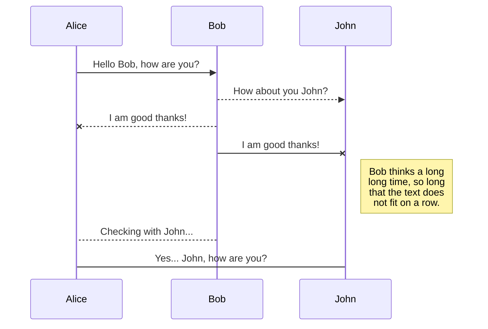
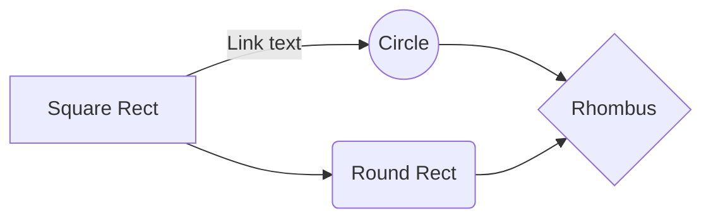

# Resilia-Projeto-Módulo-1

## Objetivo do Projeto

Este projeto foi feito como parte integrante da avaliação do Módulo 1 do curso Data Analytics da Resilia Educação da turma 20. Foi elaborado pelo Squad 9 composto pelos estudantes:

## Descrição do Projeto

Este é um projeto de FAQ (Frequently Asked Questions) para um banco, composto por quatro categorias iniciais de dúvidas, sendo que em cada uma destas categorias leva a um outro menu composto por três opções de informações a respeito do tema escolhido e ao usuário selecionar alguma das três opções disponíveis é exibido na tela o texto informativo da opção escolhida, logo em seguida o usuário escolhe encerrar o atendimento ou voltar para o menu principal para selecionar outras opções.

## Estrutura do projeto
Aqui descrevemos com mais detalhes as cada opção de forma estruturada.
- Na execução do código é exibido o menu inicial, composto da seguinte forma:
	
### Menu principal
		
	[1] Dúvidas sobre conta
	[2] Dúvidas sobre transferência
	[3] Dúvida sobre esqueci
	[4] Dúvidas sobre cartão
	[5] Encerrar o atendimento

### [1] Dúvidas sobre conta

- Ao acessar este menu irão surgir as seguintes opções:

		[1] Abertura de conta
		[2] Ativação de conta
		[3] Encerramento de conta
		[4] Retornar ao menu principal
		[5] Encerrar o atendimento
		
- As opções [4] e [5] retornam o usuário ao menu principal e encerra a a execução programa respectivamente.

- Selecionando as opções [1],[2] ou [3] a resposta será estruturada da seguinte forma:

				"Exibe a informação solicitada"
	
				[1] Voltar ao início
				[2] Sair

	 - Aqui também as opções [1] e [2] retornam o usuário ao menu principal e encerra a a execução programa respectivamente.

### [2] Dúvidas sobre transferências

### [3] Dúvidas sobre ?

### [4] Dúvidas sobre cartão

- Ao acessar este menu irão surgir as seguintes opções:

		[1] Solicitação de cartão
		[2] Desbloqueio, bloqueio e cancelamento
		[3] Limites de crédito
		[4] Retornar ao menu principal
		[0] Encerrar o atendimento
		
- As opções [4] e [0] retornam o usuário ao menu principal e encerra a a execução programa respectivamente.

- Selecionando as opções [1],[2] ou [3] a resposta será estruturada da seguinte forma:
  - [1] Solicitação de cartão

				[1] Documentos necessários para solicitar um cartão
				[2] Tipos de cartões que disponibilizamos
				[3] Anuidade
				[0] Sair
 
  - [2] Desbloqueio, bloqueio e cancelamento

				[1] Desbloqueio
				[2] Bloqueio por perda ou roubo
				[3] Cancelamento
				[0] Sair
	 
  - [3] Limites de crédito

				[1] Ajuste de limite
				[2] Solicitar aumento de limite
				[3] Por que meu pedido de aumento de limite foi negado?
				[0] Sair

	 - Para cada uma da das três opções dentro de cada submenu da opção "Dúvidas sobre cartão" a saída é estruturada da seguinte forma:
	 
			"Exibe a informação solicitada"
			
				[0] Sair
	
	 - A opção **[0] Sair** está disponível em todas as opções acessadas nos submenus da opção "Dúvidas sobre cartão" ela é estruturada da seguinte forma:
	 
				[1] Voltar ao submenu anterior
				[2] Voltar ao menu [Dúvidas sobre cartão]
				[3] Voltar ao menu principal 
				[0] Encerrar o atendimento
	 
### [5] Encerrar o atendimento
- Ao selecionar esta opção o programa é encerrado.

 **offline!**

> **Note:** The **Synchronize now** button is disabled if you have no file to synchronize.

 [Handlebars templates](http://handlebarsjs.com/)

# Markdown extensions

StackEdit extends the standard Markdown syntax by adding extra **Markdown extensions**, providing you with some nice features.

> **ProTip:** You can disable any **Markdown extension** in the **File properties** dialog.

## SmartyPants

SmartyPants converts ASCII punctuation characters into "smart" typographic punctuation HTML entities. For example:

|                |ASCII                          |HTML                         |
|----------------|-------------------------------|-----------------------------|
|Single backticks|`'Isn't this fun?'`            |'Isn't this fun?'            |
|Quotes          |`"Isn't this fun?"`            |"Isn't this fun?"            |
|Dashes          |`-- is en-dash, --- is em-dash`|-- is en-dash, --- is em-dash|

## KaTeX

You can render LaTeX mathematical expressions using [KaTeX](https://khan.github.io/KaTeX/):

The *Gamma function* satisfying $\Gamma(n) = (n-1)!\quad\forall n\in\mathbb N$ is via the Euler integral

$$
\Gamma(z) = \int_0^\infty t^{z-1}e^{-t}dt\,.
$$

> You can find more information about **LaTeX** mathematical expressions [here](http://meta.math.stackexchange.com/questions/5020/mathjax-basic-tutorial-and-quick-reference).

## UML diagrams

You can render UML diagrams using [Mermaid](https://mermaidjs.github.io/). For example, this will produce a sequence diagram:

And this will produce a flow chart:

